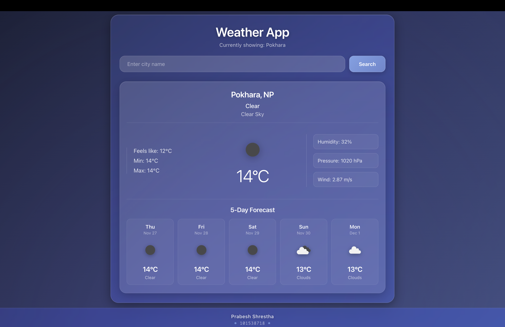
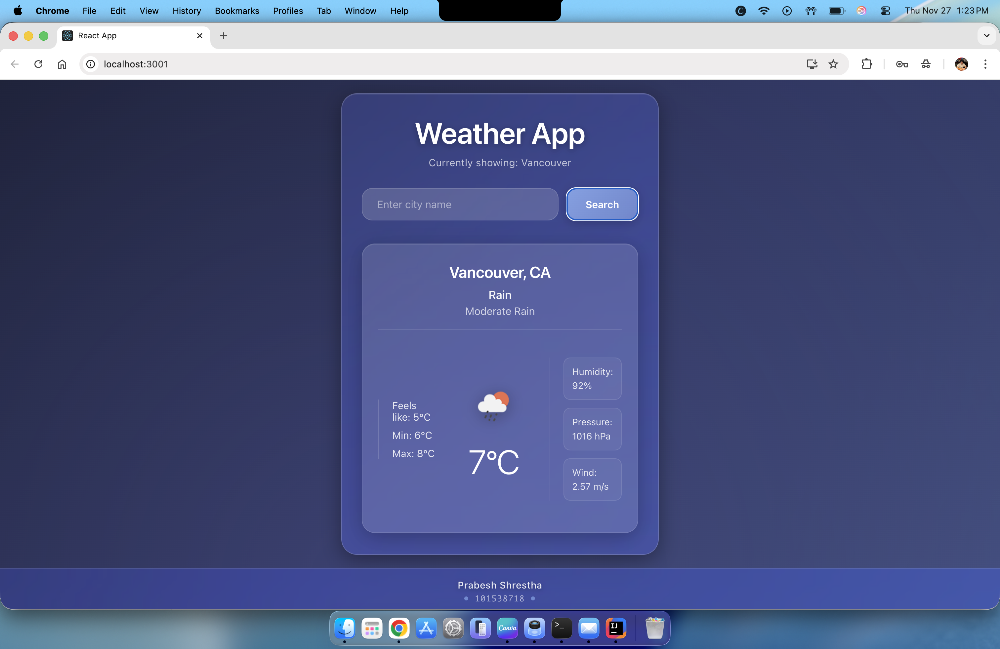

# Weather App - COMP3123 Lab Test 2

**Student Name:** Prabesh Shrestha  
**Student ID:** 101538718  
**Course:** COMP3123 - Full Stack Development  
**Date:** November 27, 2024

---

## 📖 Project Overview

A modern React weather application that displays real-time weather information for cities worldwide using the OpenWeatherMap API. The app features a beautiful glassmorphism UI design with smooth animations and a fully responsive layout.

**🌐 Live Demo:** [https://101538718-comp3123-labtest2.vercel.app/](https://101538718-comp3123-labtest2.vercel.app/)

---

## ✨ Features

- 🔍 Search weather by city name
- 🌡️ Display current temperature with min/max values
- 💨 Show detailed weather information (humidity, pressure, wind speed)
- ☀️ Dynamic weather icons
- 🎨 Modern glassmorphism UI design
- 📱 Fully responsive layout
- ⚡ Real-time weather updates
- ⚠️ Error handling with user-friendly messages

---

## 🛠️ Technologies Used

- **React** (Hooks: useState, useEffect)
- **JavaScript (ES6+)**
- **CSS3** (Glassmorphism effects, animations)
- **OpenWeatherMap API**
- **Create React App**

---

## 📸 Application Screenshots

### Home Screen - Default View (Toronto)


### Search Functionality - City Search


### Search Results - Different City


---

## 📁 Project Structure

```
101538718_comp3123_labtest2/
├── public/
│   ├── index.html
│   ├── favicon.ico
│   └── manifest.json
├── src/
│   ├── components/
│   │   ├── SearchBar.jsx      # Search input component
│   │   └── WeatherCard.jsx    # Weather display component
│   ├── App.js                  # Main application
│   ├── App.css                 # Styles with glassmorphism
│   ├── index.js                # Entry point
│   └── index.css               # Global styles
├── screenshots/                # Application screenshots
├── package.json
└── README.md
```

---

## Installation & Setup

### Prerequisites
- Node.js (v14 or higher)
- npm package manager

### Steps to Run

1. **Clone the repository**
```bash
git clone <repository-url>
cd 101538718_comp3123_labtest2
```

2. **Install dependencies**
```bash
npm install
```

3. **Start development server**
```bash
npm start
```

The app will open at [http://localhost:3000](http://localhost:3000)

4. **Build for production**
```bash
npm run build
```

---

## 🌐 API Integration

**API Used:** OpenWeatherMap Current Weather Data API

- **Endpoint:** `https://api.openweathermap.org/data/2.5/weather`
- **Documentation:** [OpenWeatherMap Docs](https://openweathermap.org/current)
- **Data Format:** JSON
- **Units:** Metric (Celsius, m/s)

### API Response Data:
- Current temperature
- Min/Max temperature
- Feels like temperature
- Weather condition and description
- Humidity percentage
- Atmospheric pressure
- Wind speed
- Weather icons

---

## 🎯 React Concepts Implemented

### State Management (useState)
- `city` - Current city name
- `weatherData` - API response data
- `loading` - Loading state
- `error` - Error messages

### Side Effects (useEffect)
- Fetches Toronto weather on initial load
- Dependency array ensures single execution

### Component Architecture
- **SearchBar** - Handles city search input
- **WeatherCard** - Displays weather information
- Props passed between parent and child components

### Key Features
- Async/await for API calls
- Conditional rendering (loading, error, data states)
- Form handling with event prevention
- Error handling with try-catch blocks

---

## 🎨 Design Highlights

### Glassmorphism Effect
- Backdrop blur filters
- Semi-transparent backgrounds
- Layered shadows for depth
- Smooth hover animations

### Responsive Design
- Mobile-first approach
- Flexible layouts with Flexbox
- Media queries for different screen sizes
- Touch-friendly interface

### Color Scheme
- Background: Navy gradient (#1a1f36 → #3d4b7d)
- Accent: Light blue (#8ab4f8)
- Text: White with opacity variations

---


## 👨‍💻 Author

**Prabesh Shrestha**  
Student ID: 101538718  
George Brown College  
COMP3123 - Full Stack Development

---


**Last Updated:** November 27, 2024
